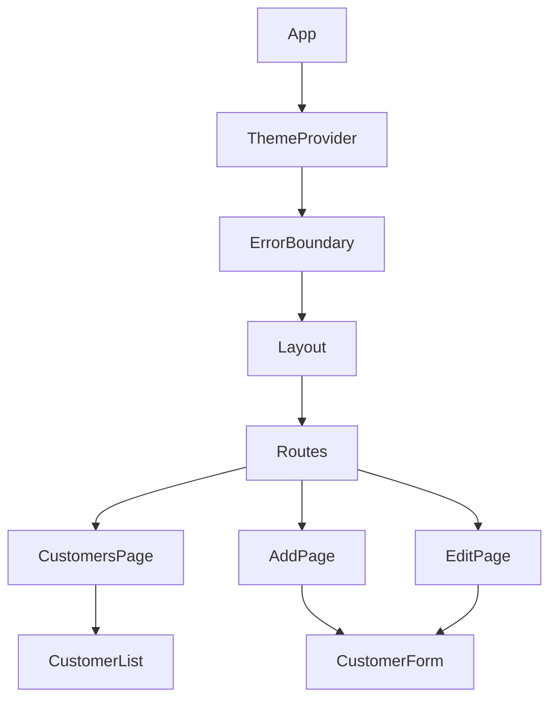
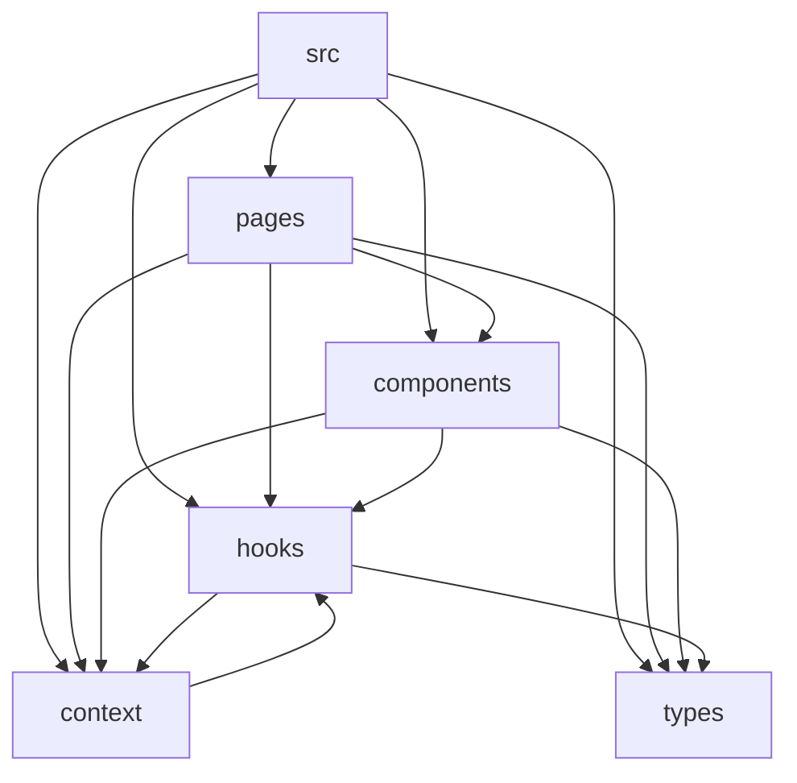

# App Architecture Overview

## Overview:
This document goes over the architecture of this customer info manager app. It covers app tree layout, components, data flow and architecture plan.


## App Component Tree:



## Component Hierarchy:


**Pages** - Customers.tsx, Add.tsx, Edit.tsx are route-level containers (fetch/submit/navigation orchestration).

**Components** - Holds reusable UI/presentation blocks (Header, Navbar, Layout, CustomerList, CustomerForm, ErrorBoundary), and component tests

**Hooks** - useCustomerApi.tsx centralizes API + dispatch logic; useLocalStorage.tsx persists state (theme/sorting).

**Context** - CustomerContext.tsx is app-wide customer state via reducer; ThemeContext.tsx manages light/dark theme.

**Types** - customer.ts defines shared Customer and CustomerFormData TypeScript contracts used across pages/components/hooks.


## Architecture Plan:
**Where does state live?:**

Customer state and Theme state live in Context components and use providers to wrap the app and provide context to all child components, this allows state to exist across the different parts of the app without the need for prop drilling. The useState React hook was also used to store local component state when appropriate. 

**How are CRUD operations managed?:**

CRUD operations are managed with useReducer for scalability. This allows for easy scalability of app logic if more components are added or more ways of manipulating customer data is needed.

**What Custom Hooks were needed?:**
useCustomerApi was needed for fetching data from the customer database. All logic for dispatching different requests to the server (GET, POST, PUT, DELETE) used this hook. useLocalStorage was needed to store local values in the browsers memory, allowing the stored values to persist over sessions and re-renders. This was used for storing whichever Theme the user selects and for storing if the CustomerList component is either unsorted, sorted(ascending) or sorted(descending)

**How does the form handle both the add and edit modes?:**
The form handles both modes with the same component by using different props. When in add mode the form renders without the intialData prop. In edit mode the same form renders but gets and passes in the intialData prop that renders in the input fields  


## Prerequisites:
- Basic understanding of the following:
    - React Components
    - React Router
    - JavaScript
    - TypeScript
    - Hooks
    - Forms and Validation
    - State Management
    - API Integration
    - Vitest and React Testing Library
    - Deployment


## Main Components:
- **CustomerList** - Renders a table element populated with the customer data recieved from the server. It also contains the logic for filtering the list by user query and for sorting the list alphabetically in ascending or descending order.

- **CustomerForm** - Renders a form element that allows you to add/edit customer info to/in the customer database. This info will be dispatched with a POST/PUT request to the server and rendered in the table made by the CustomerList component.


## Data Flow:
1. App fetches data from db.json and populates a list of customers.

2. User can click the Add button to navigate to a form that allows them to add new customer data to the customer database.

3. User can click the Edit button in one of the list items in the main customers list to navigate to a form that allows them to edit the info of an existing customer in the database.

4. User can click the Delete button in one of the list items in the main customers list to delete an existing customer in the database.

5. Database keeps track of customer data and will automatically update based off of user input. It will also automatically assign an id number to each database entry.

## API/Server Integration and Configuration:
**JSON Server API Integration**
 - JSON Server runs from the api script in package.json as ```json-server --watch [db.json](http://_vscodecontentref_/1) --port 3001```, using db.json as the backing datastore (customers collection).
   
 - Frontend API calls are centralized in useCustomerApi.tsx and use relative endpoints like /api/customers and /api/customers/:id for ```GET```, ```POST```, ```PUT```, ```DELETE```.

 - Each API response dispatches into CustomerContext state (```SET_CUSTOMERS```, ```ADD_CUSTOMER```, ```UPDATE_CUSTOMER```, ```DELETE_CUSTOMER```) so UI updates immediately after server success


**Vite Proxy**
 - Dev proxy is configured in vite.config.ts: ```/api → http://localhost:3001``` with rewrite: path.replace(/^\/api/, '').

 - Result: browser calls /api/customers, Vite forwards to JSON Server as /customers (same origin in dev, avoids CORS issues)

 - changeOrigin: true makes proxied requests appear as if they target the backend host.


## Deployment Model:
- **Frontend**: Deployed to GitHub Pages
  
- **Backend**: This app uses an internal json file and the JSON Server API to simulate requests to and responses from
an actual server. This only works on local hardware and as such the deployed version of the app to GitHub does not have access to the simulated "backend"


## Scalability:
- The customer database will auto-scale as more entries are added.


## Technical Descisions and Trade-offs:

**Problem:** Whether to use useState or a reducer with Context for managing App State.

**Outcome:** useReducer with Context

**Trade-Offs:** 
- Lost: Simplicity
- Gained: Better control of app state.

**Rationale:** This allows a better setup for app scalability as there is now one source of truth for all Customer state in the app and all logic for the different dispatches is in one place as well, allowing for more to be added later on with less chance of breaking functionality.
